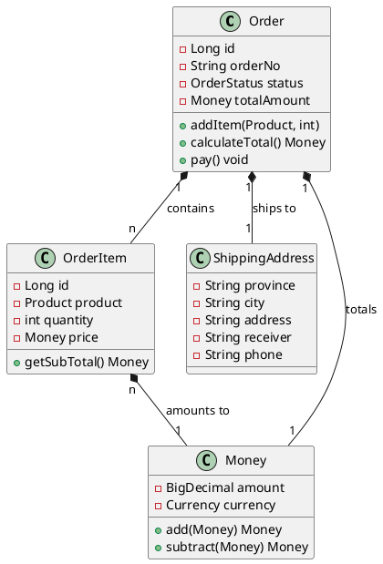

# DDD 开发操作手册

## 目录

1. [环境准备](#1-环境准备)
2. [项目初始化](#2-项目初始化)
3. [领域建模](#3-领域建模)
4. [代码实现](#4-代码实现)
5. [测试编写](#5-测试编写)
6. [代码审查](#6-代码审查)
7. [部署上线](#7-部署上线)

---

## 1. 环境准备

### 1.1 开发工具安装

#### 必备工具
```bash
# 1. JDK 17+
java -version

# 2. Maven 3.6+
mvn -version

# 3. Git
git --version

# 4. IntelliJ IDEA 2023+
# 推荐使用 Ultimate 版本（支持 Spring Boot）
```

#### IDEA 插件安装
```
必需插件：
- Lombok Plugin
- Maven Helper
- SonarLint
- GitToolBox

推荐插件：
- Alibaba Java Coding Guidelines
- Rainbow Brackets
- String Manipulation
- Key Promoter X
- Translation
```

### 1.2 环境配置

#### IDEA 配置
```
1. 设置编码
   File → Settings → Editor → File Encodings
   - Global Encoding: UTF-8
   - Project Encoding: UTF-8
   - Default encoding for properties files: UTF-8

2. 配置 Maven
   File → Settings → Build, Execution, Deployment → Build Tools → Maven
   - Maven home directory: 指定本地 Maven 安装路径
   - User settings file: ~/.m2/settings.xml
   - Local repository: 指定本地仓库路径

3. 配置代码风格
   File → Settings → Editor → Code Style → Java
   - 导入项目根目录的 idea-codestyle.xml

4. 启用自动保存
   File → Settings → Appearance & Behavior → System Settings
   - 勾选 "Save file on frame deactivation"

5. 配置保存时动作
   File → Settings → Tools → Actions on Save
   - 勾选 "Reformat code"
   - 勾选 "Optimize imports"
   - 勾选 "Remove unused imports"

6. 启用 EditorConfig
   File → Settings → Editor → Code Style
   - 勾选 "Enable EditorConfig support"
```

#### Maven Settings 配置
```xml
<!-- ~/.m2/settings.xml -->
<settings>
    <mirrors>
        <!-- 阿里云镜像 -->
        <mirror>
            <id>aliyun</id>
            <mirrorOf>central</mirrorOf>
            <name>Aliyun Maven</name>
            <url>https://maven.aliyun.com/repository/public</url>
        </mirror>
    </mirrors>

    <profiles>
        <profile>
            <id>jdk-17</id>
            <activation>
                <activeByDefault>true</activeByDefault>
                <jdk>17</jdk>
            </activation>
            <properties>
                <maven.compiler.source>17</maven.compiler.source>
                <maven.compiler.target>17</maven.compiler.target>
                <maven.compiler.compilerVersion>17</maven.compiler.compilerVersion>
            </properties>
        </profile>
    </profiles>
</settings>
```

### 1.3 项目克隆与导入

```bash
# 1. 克隆项目
git clone <repository-url>
cd dms2-project

# 2. 编译项目
mvn clean install -DskipTests

# 3. 导入 IDEA
# File → Open → 选择项目根目录的 pom.xml
```

---

## 2. 项目初始化

### 2.1 创建新模块

#### 步骤1: 创建模块目录
```bash
cd dms2-project
mkdir dms2-new-module
```

#### 步骤2: 创建 pom.xml
```xml
<?xml version="1.0" encoding="UTF-8"?>
<project xmlns="http://maven.apache.org/POM/4.0.0"
         xmlns:xsi="http://www.w3.org/2001/XMLSchema-instance"
         xsi:schemaLocation="http://maven.apache.org/POM/4.0.0
         http://maven.apache.org/xsd/maven-4.0.0.xsd">
    <modelVersion>4.0.0</modelVersion>

    <parent>
        <groupId>com.example</groupId>
        <artifactId>dms2-project</artifactId>
        <version>1.0.0-SNAPSHOT</version>
    </parent>

    <artifactId>dms2-new-module</artifactId>
    <packaging>jar</packaging>

    <name>DMS2 New Module</name>
    <description>新模块描述</description>

    <dependencies>
        <!-- 根据模块类型添加依赖 -->
    </dependencies>
</project>
```

#### 步骤3: 注册到父 pom
```xml
<!-- 在父 pom.xml 的 <modules> 中添加 -->
<modules>
    <module>dms2-api</module>
    <module>dms2-domain</module>
    <module>dms2-application</module>
    <module>dms2-infrastructure</module>
    <module>dms2-interface</module>
    <module>dms2-new-module</module>  <!-- 新增 -->
</modules>
```

#### 步骤4: 创建包结构
```bash
cd dms2-new-module
mkdir -p src/main/java/com/example/dms2/newmodule
mkdir -p src/main/resources
mkdir -p src/test/java/com/example/dms2/newmodule
mkdir -p src/test/resources
```

### 2.2 配置模块依赖

#### API 模块依赖
```xml
<dependencies>
    <!-- 只依赖基础库，不依赖业务模块 -->
    <dependency>
        <groupId>org.springframework.boot</groupId>
        <artifactId>spring-boot-starter-web</artifactId>
    </dependency>
    <dependency>
        <groupId>org.springframework.cloud</groupId>
        <artifactId>spring-cloud-starter-openfeign</artifactId>
    </dependency>
    <dependency>
        <groupId>jakarta.validation</groupId>
        <artifactId>jakarta.validation-api</artifactId>
    </dependency>
    <dependency>
        <groupId>org.projectlombok</groupId>
        <artifactId>lombok</artifactId>
    </dependency>
</dependencies>
```

#### Domain 模块依赖
```xml
<dependencies>
    <!-- 依赖 API 模块 -->
    <dependency>
        <groupId>com.example</groupId>
        <artifactId>dms2-api</artifactId>
    </dependency>
    <dependency>
        <groupId>org.springframework.boot</groupId>
        <artifactId>spring-boot-starter</artifactId>
    </dependency>
    <dependency>
        <groupId>org.projectlombok</groupId>
        <artifactId>lombok</artifactId>
    </dependency>
</dependencies>
```

#### Application 模块依赖
```xml
<dependencies>
    <!-- 依赖 Domain 和 API -->
    <dependency>
        <groupId>com.example</groupId>
        <artifactId>dms2-domain</artifactId>
    </dependency>
    <dependency>
        <groupId>com.example</groupId>
        <artifactId>dms2-api</artifactId>
    </dependency>
    <dependency>
        <groupId>org.springframework.boot</groupId>
        <artifactId>spring-boot-starter</artifactId>
    </dependency>
    <dependency>
        <groupId>org.mapstruct</groupId>
        <artifactId>mapstruct</artifactId>
    </dependency>
</dependencies>
```

#### Infrastructure 模块依赖
```xml
<dependencies>
    <!-- 依赖 Domain -->
    <dependency>
        <groupId>com.example</groupId>
        <artifactId>dms2-domain</artifactId>
    </dependency>
    <dependency>
        <groupId>org.springframework.boot</groupId>
        <artifactId>spring-boot-starter-data-jpa</artifactId>
    </dependency>
    <dependency>
        <groupId>org.mapstruct</groupId>
        <artifactId>mapstruct</artifactId>
    </dependency>
</dependencies>
```

#### Interface 模块依赖
```xml
<dependencies>
    <!-- 依赖所有业务模块 -->
    <dependency>
        <groupId>com.example</groupId>
        <artifactId>dms2-application</artifactId>
    </dependency>
    <dependency>
        <groupId>com.example</groupId>
        <artifactId>dms2-infrastructure</artifactId>
    </dependency>
    <dependency>
        <groupId>com.example</groupId>
        <artifactId>dms2-api</artifactId>
    </dependency>
    <dependency>
        <groupId>org.springframework.boot</groupId>
        <artifactId>spring-boot-starter-web</artifactId>
    </dependency>
    <dependency>
        <groupId>org.springdoc</groupId>
        <artifactId>springdoc-openapi-starter-webmvc-ui</artifactId>
    </dependency>
</dependencies>
```

---

## 3. 领域建模

### 3.1 需求分析

#### 步骤1: 收集需求
```
与产品经理、业务专家沟通，了解：
1. 业务目标
2. 核心业务流程
3. 业务规则
4. 约束条件
```

#### 步骤2: 识别核心领域
```
问题域分类：

核心域（决定业务成败）：
- 订单管理
- 库存管理
- 支付处理

支撑域（支持核心业务）：
- 用户管理
- 权限管理
- 通知服务

通用域（可采购或使用开源）：
- 日志记录
- 文件存储
- 短信发送
```

#### 步骤3: 划定限界上下文
```
根据业务边界划分上下文：

订单上下文：
- 订单、订单项、配送地址

用户上下文：
- 用户、用户信息、偏好设置

库存上下文：
- 商品、库存、库存变动

支付上下文：
- 支付、支付记录、退款
```

### 3.2 领域建模

#### 步骤1: 识别聚合
```
方法：
1. 找出业务中紧密相关的对象
2. 确定哪些对象需要保持一致性
3. 选择一个对象作为聚合根

示例：订单聚合
聚合根: Order
成员: OrderItem, ShippingAddress

一致性边界：
- 订单和订单项必须保持一致
- 通过订单根来操作订单项
```

#### 步骤2: 识别实体和值对象
```
实体（有唯一标识）：
- Order（订单）
- OrderItem（订单项）
- User（用户）

值对象（不可变）：
- Money（金额）
- Address（地址）
- Email（邮箱）
- PhoneNumber（手机号）
```

#### 步骤3: 定义仓储接口
```
位置：domain/repository

原则：
1. 以聚合根为单位
2. 接口不依赖技术细节
3. 方法名表达业务意图

示例：
public interface OrderRepository {
    // 保存聚合
    Order save(Order order);

    // 根据ID查找
    Optional<Order> findById(Long id);

    // 根据业务规则查找
    List<Order> findByUserId(Long userId);
    List<Order> findByStatus(OrderStatus status);

    // 判断存在性
    boolean existsByOrderNo(String orderNo);
}
```

#### 步骤4: 识别领域服务
```
场景：
1. 跨聚合的业务逻辑
2. 无状态的计算逻辑
3. 领域逻辑的编排

示例：
@DomainService
public class OrderDomainService {

    /**
     * 计算订单金额（跨多个聚合）
     */
    public Money calculateAmount(Order order, List<Coupon> coupons, UserVipLevel vipLevel) {
        Money total = order.calculateTotal();
        Money discount = calculateDiscount(coupons, vipLevel);
        return total.subtract(discount);
    }
}
```

### 3.3 绘制领域模型图

#### 使用 PlantUML


---

## 4. 代码实现

### 4.1 创建实体

#### 步骤1: 在 domain/model/entity 创建实体类
```bash
mkdir -p dms2-domain/src/main/java/com/example/dms2/domain/model/entity
```

#### 步骤2: 编写实体代码
```java
package com.example.dms2.domain.model.entity;

import com.example.dms2.domain.exception.BusinessException;
import jakarta.persistence.*;
import lombok.*;
import java.time.LocalDateTime;
import java.util.ArrayList;
import java.util.Collections;
import java.util.List;

/**
 * 订单实体
 *
 * 聚合根
 */
@Entity
@Data
@NoArgsConstructor
@AllArgsConstructor
@Builder
public class Order {

    // ===== 唯一标识 =====

    @Id
    @GeneratedValue(strategy = GenerationType.IDENTITY)
    private Long id;

    /**
     * 订单号（业务标识）
     */
    @Column(unique = true, nullable = false)
    private String orderNo;


    // ===== 聚合成员 =====

    /**
     * 订单项列表
     */
    @OneToMany(cascade = CascadeType.ALL, orphanRemoval = true)
    private List<OrderItem> items = new ArrayList<>();

    /**
     * 配送地址
     */
    @Embedded
    private ShippingAddress shippingAddress;


    // ===== 属性 =====

    /**
     * 用户ID（引用其他聚合）
     */
    private Long userId;

    /**
     * 订单状态
     */
    @Enumerated(EnumType.STRING)
    private OrderStatus status;

    /**
     * 订单总金额
     */
    @Embedded
    private Money totalAmount;

    /**
     * 创建时间
     */
    private LocalDateTime createTime;

    /**
     * 更新时间
     */
    private LocalDateTime updateTime;


    // ===== 领域行为 =====

    /**
     * 添加订单项
     */
    public void addItem(Product product, int quantity) {
        OrderItem item = new OrderItem(product, quantity);
        this.items.add(item);
        recalculateTotal();
    }

    /**
     * 移除订单项
     */
    public void removeItem(Long itemId) {
        this.items.removeIf(item -> item.getId().equals(itemId));
        recalculateTotal();
    }

    /**
     * 设置配送地址
     */
    public void setShippingAddress(ShippingAddress address) {
        if (status != OrderStatus.PENDING) {
            throw new BusinessException("只能修改待支付订单的配送地址");
        }
        this.shippingAddress = address;
    }

    /**
     * 支付订单
     */
    public void pay() {
        if (status != OrderStatus.PENDING) {
            throw new BusinessException("订单状态不允许支付");
        }
        if (items.isEmpty()) {
            throw new BusinessException("订单为空，不能支付");
        }
        this.status = OrderStatus.PAID;
        this.updateTime = LocalDateTime.now();
    }

    /**
     * 发货
     */
    public void ship() {
        if (status != OrderStatus.PAID) {
            throw new BusinessException("订单状态不允许发货");
        }
        if (shippingAddress == null) {
            throw new BusinessException("请先设置配送地址");
        }
        this.status = OrderStatus.SHIPPED;
        this.updateTime = LocalDateTime.now();
    }


    // ===== 业务规则 =====

    /**
     * 重新计算订单总金额
     */
    private void recalculateTotal() {
        this.totalAmount = items.stream()
            .map(OrderItem::getSubTotal)
            .reduce(Money.ZERO, Money::add);
    }

    /**
     * 验证订单状态
     */
    public void validateForCreate() {
        if (orderNo == null || orderNo.trim().isEmpty()) {
            throw new BusinessException("订单号不能为空");
        }
        if (userId == null) {
            throw new BusinessException("用户ID不能为空");
        }
        if (items.isEmpty()) {
            throw new BusinessException("订单至少需要一个订单项");
        }
    }


    // ===== 生命周期方法 =====

    /**
     * 创建前初始化
     */
    @PrePersist
    public void onCreate() {
        this.createTime = LocalDateTime.now();
        this.updateTime = LocalDateTime.now();
        this.status = OrderStatus.PENDING;
        recalculateTotal();
    }

    /**
     * 更新前刷新时间
     */
    @PreUpdate
    public void onUpdate() {
        this.updateTime = LocalDateTime.now();
    }


    // ===== 访问控制 =====

    /**
     * 返回不可修改的订单项列表
     */
    public List<OrderItem> getItems() {
        return Collections.unmodifiableList(items);
    }
}
```

### 4.2 创建值对象

#### 步骤1: 在 domain/model/valueobject 创建值对象类
```bash
mkdir -p dms2-domain/src/main/java/com/example/dms2/domain/model/valueobject
```

#### 步骤2: 编写值对象代码
```java
package com.example.dms2.domain.model.valueobject;

import jakarta.persistence.Embeddable;
import lombok.AllArgsConstructor;
import lombok.Data;
import lombok.NoArgsConstructor;
import java.math.BigDecimal;
import java.util.Currency;

/**
 * 金额值对象
 * 特点：不可变、可替换
 */
@Embeddable
@Data
@NoArgsConstructor
@AllArgsConstructor
public class Money {

    /**
     * 零值常量
     */
    public static final Money ZERO = new Money(BigDecimal.ZERO, Currency.getInstance("CNY"));

    /**
     * 金额
     */
    private BigDecimal amount;

    /**
     * 货币
     */
    private Currency currency;


    // ===== 工厂方法 =====

    /**
     * 创建人民币金额
     */
    public static Money of(BigDecimal amount) {
        return new Money(amount, Currency.getInstance("CNY"));
    }

    /**
     * 创建人民币金额（字符串）
     */
    public static Money of(String amount) {
        return new Money(new BigDecimal(amount), Currency.getInstance("CNY"));
    }


    // ===== 值对象行为 =====

    /**
     * 加法
     */
    public Money add(Money other) {
        checkSameCurrency(other);
        return new Money(this.amount.add(other.amount), this.currency);
    }

    /**
     * 减法
     */
    public Money subtract(Money other) {
        checkSameCurrency(other);
        return new Money(this.amount.subtract(other.amount), this.currency);
    }

    /**
     * 乘法
     */
    public Money multiply(int multiplier) {
        return new Money(this.amount.multiply(new BigDecimal(multiplier)), this.currency);
    }

    /**
     * 比较大小
     */
    public boolean greaterThan(Money other) {
        checkSameCurrency(other);
        return this.amount.compareTo(other.amount) > 0;
    }


    // ===== 业务规则 =====

    /**
     * 检查货币是否相同
     */
    private void checkSameCurrency(Money other) {
        if (!this.currency.equals(other.currency)) {
            throw new IllegalArgumentException("货币类型不同");
        }
    }


    // ===== 相等性判断 =====

    @Override
    public boolean equals(Object obj) {
        if (this == obj) return true;
        if (!(obj instanceof Money)) return false;
        Money other = (Money) obj;
        return this.currency.equals(other.currency)
            && this.amount.compareTo(other.amount) == 0;
    }

    @Override
    public int hashCode() {
        return currency.hashCode() + amount.hashCode();
    }
}
```

### 4.3 创建仓储接口

#### 步骤1: 在 domain/repository 创建仓储接口
```bash
mkdir -p dms2-domain/src/main/java/com/example/dms2/domain/repository
```

#### 步骤2: 编写仓储接口
```java
package com.example.dms2.domain.repository;

import com.example.dms2.domain.model.entity.Order;
import com.example.dms2.domain.model.valueobject.OrderStatus;

import java.time.LocalDateTime;
import java.util.List;
import java.util.Optional;

/**
 * 订单仓储接口
 * 定义在领域层，实现在基础设施层
 */
public interface OrderRepository {

    /**
     * 保存订单（聚合根）
     */
    Order save(Order order);

    /**
     * 根据ID查找订单
     */
    Optional<Order> findById(Long id);

    /**
     * 根据订单号查找
     */
    Optional<Order> findByOrderNo(String orderNo);

    /**
     * 根据用户ID查找订单
     */
    List<Order> findByUserId(Long userId);

    /**
     * 根据状态查找订单
     */
    List<Order> findByStatus(OrderStatus status);

    /**
     * 查找用户的订单（按状态筛选）
     */
    List<Order> findByUserIdAndStatus(Long userId, OrderStatus status);

    /**
     * 判断订单号是否存在
     */
    boolean existsByOrderNo(String orderNo);

    /**
     * 删除订单
     */
    void deleteById(Long id);

    /**
     * 查找指定时间范围内的订单
     */
    List<Order> findByCreateTimeBetween(LocalDateTime start, LocalDateTime end);

    /**
     * 统计用户订单数量
     */
    long countByUserId(Long userId);
}
```

### 4.4 实现仓储

#### 步骤1: 在 infrastructure/repository 创建实现类
```bash
mkdir -p dms2-infrastructure/src/main/java/com/example/dms2/infrastructure/repository
```

#### 步骤2: 编写仓储实现
```java
package com.example.dms2.infrastructure.repository;

import com.example.dms2.domain.model.entity.Order;
import com.example.dms2.domain.model.valueobject.OrderStatus;
import com.example.dms2.domain.repository.OrderRepository;
import com.example.dms2.infrastructure.mapping.OrderMapper;
import com.example.dms2.infrastructure.persistence.OrderJpaRepository;
import com.example.dms2.infrastructure.persistence.OrderEntity;
import lombok.RequiredArgsConstructor;
import org.springframework.stereotype.Repository;

import java.time.LocalDateTime;
import java.util.List;
import java.util.Optional;

/**
 * 订单仓储实现
 */
@Repository
@RequiredArgsConstructor
public class OrderRepositoryImpl implements OrderRepository {

    private final OrderJpaRepository jpaRepository;
    private final OrderMapper mapper;


    @Override
    public Order save(Order order) {
        OrderEntity entity = mapper.toEntity(order);
        OrderEntity saved = jpaRepository.save(entity);
        return mapper.toDomain(saved);
    }

    @Override
    public Optional<Order> findById(Long id) {
        return jpaRepository.findById(id)
            .map(mapper::toDomain);
    }

    @Override
    public Optional<Order> findByOrderNo(String orderNo) {
        return jpaRepository.findByOrderNo(orderNo)
            .map(mapper::toDomain);
    }

    @Override
    public List<Order> findByUserId(Long userId) {
        return jpaRepository.findByUserId(userId).stream()
            .map(mapper::toDomain)
            .toList();
    }

    @Override
    public List<Order> findByStatus(OrderStatus status) {
        return jpaRepository.findByStatus(status).stream()
            .map(mapper::toDomain)
            .toList();
    }

    @Override
    public List<Order> findByUserIdAndStatus(Long userId, OrderStatus status) {
        return jpaRepository.findByUserIdAndStatus(userId, status).stream()
            .map(mapper::toDomain)
            .toList();
    }

    @Override
    public boolean existsByOrderNo(String orderNo) {
        return jpaRepository.existsByOrderNo(orderNo);
    }

    @Override
    public void deleteById(Long id) {
        jpaRepository.deleteById(id);
    }

    @Override
    public List<Order> findByCreateTimeBetween(LocalDateTime start, LocalDateTime end) {
        return jpaRepository.findByCreateTimeBetween(start, end).stream()
            .map(mapper::toDomain)
            .toList();
    }

    @Override
    public long countByUserId(Long userId) {
        return jpaRepository.countByUserId(userId);
    }
}
```

### 4.5 创建应用服务

#### 步骤1: 在 application/service 创建应用服务
```bash
mkdir -p dms2-application/src/main/java/com/example/dms2/application/service
```

#### 步骤2: 编写应用服务
```java
package com.example.dms2.application.service;

import com.example.dms2.api.dto.request.CreateOrderRequest;
import com.example.dms2.api.dto.response.OrderDTO;
import com.example.dms2.application.assembler.OrderAssembler;
import com.example.dms2.domain.model.entity.Order;
import com.example.dms2.domain.repository.OrderRepository;
import com.example.dms2.domain.repository.ProductRepository;
import lombok.RequiredArgsConstructor;
import lombok.extern.slf4j.Slf4j;
import org.springframework.stereotype.Service;
import org.springframework.transaction.annotation.Transactional;

/**
 * 订单应用服务
 */
@Slf4j
@Service
@RequiredArgsConstructor
public class OrderAppService {

    private final OrderRepository orderRepository;
    private final ProductRepository productRepository;
    private final OrderAssembler orderAssembler;


    /**
     * 创建订单
     */
    @Transactional
    public OrderDTO createOrder(CreateOrderRequest request) {
        log.info("创建订单: request={}", request);

        // 1. 创建订单聚合
        Order order = Order.builder()
            .orderNo(generateOrderNo())
            .userId(request.getUserId())
            .build();

        // 2. 添加订单项
        request.getItems().forEach(itemRequest -> {
            var product = productRepository.findById(itemRequest.getProductId())
                .orElseThrow(() -> new BusinessException("商品不存在"));

            order.addItem(product, itemRequest.getQuantity());
        });

        // 3. 设置配送地址
        order.setShippingAddress(orderAssembler.toAddress(request.getShippingAddress()));

        // 4. 业务校验
        order.validateForCreate();

        // 5. 保存
        Order savedOrder = orderRepository.save(order);

        log.info("订单创建成功: id={}, orderNo={}", savedOrder.getId(), savedOrder.getOrderNo());

        return orderAssembler.toDTO(savedOrder);
    }

    /**
     * 支付订单
     */
    @Transactional
    public void payOrder(Long orderId) {
        log.info("支付订单: orderId={}", orderId);

        Order order = orderRepository.findById(orderId)
            .orElseThrow(() -> new BusinessException("订单不存在"));

        // 调用领域行为
        order.pay();

        // 保存
        orderRepository.save(order);

        log.info("订单支付成功: orderId={}", orderId);
    }


    // ===== 私有方法 =====

    /**
     * 生成订单号
     */
    private String generateOrderNo() {
        return "ORD" + System.currentTimeMillis();
    }
}
```

---

## 5. 测试编写

### 5.1 单元测试

#### 测试应用服务
```java
package com.example.dms2.application;

import com.example.dms2.api.dto.request.CreateOrderRequest;
import com.example.dms2.api.dto.response.OrderDTO;
import com.example.dms2.application.assembler.OrderAssembler;
import com.example.dms2.domain.model.entity.Order;
import com.example.dms2.domain.repository.OrderRepository;
import com.example.dms2.domain.repository.ProductRepository;
import org.junit.jupiter.api.BeforeEach;
import org.junit.jupiter.api.DisplayName;
import org.junit.jupiter.api.Test;
import org.junit.jupiter.api.extension.ExtendWith;
import org.mockito.InjectMocks;
import org.mockito.Mock;
import org.mockito.junit.jupiter.MockitoExtension;

import java.math.BigDecimal;
import java.util.Optional;

import static org.assertj.core.api.Assertions.*;
import static org.mockito.ArgumentMatchers.any;
import static org.mockito.Mockito.*;

@ExtendWith(MockitoExtension.class)
@DisplayName("订单应用服务测试")
class OrderAppServiceTest {

    @Mock
    private OrderRepository orderRepository;

    @Mock
    private ProductRepository productRepository;

    @Mock
    private OrderAssembler orderAssembler;

    @InjectMocks
    private OrderAppService orderAppService;

    private CreateOrderRequest request;
    private Order order;
    private OrderDTO orderDTO;

    @BeforeEach
    void setUp() {
        // 准备测试数据
        request = new CreateOrderRequest();
        request.setUserId(1L);

        order = Order.builder()
            .id(1L)
            .orderNo("ORD123456")
            .userId(1L)
            .build();

        orderDTO = new OrderDTO();
        orderDTO.setId(1L);
        orderDTO.setOrderNo("ORD123456");
    }

    @Test
    @DisplayName("创建订单 - 成功")
    void createOrder_Success() {
        // Given
        when(orderRepository.save(any(Order.class))).thenReturn(order);
        when(orderAssembler.toDTO(any(Order.class))).thenReturn(orderDTO);

        // When
        OrderDTO result = orderAppService.createOrder(request);

        // Then
        assertThat(result).isNotNull();
        assertThat(result.getOrderNo()).isEqualTo("ORD123456");

        verify(orderRepository, times(1)).save(any(Order.class));
        verify(orderAssembler, times(1)).toDTO(any(Order.class));
    }

    @Test
    @DisplayName("支付订单 - 成功")
    void payOrder_Success() {
        // Given
        Long orderId = 1L;
        when(orderRepository.findById(orderId)).thenReturn(Optional.of(order));

        // When
        orderAppService.payOrder(orderId);

        // Then
        verify(orderRepository, times(1)).save(order);
    }
}
```

### 5.2 集成测试

#### E2E 测试
```java
package com.example.dms2.interface;

import com.example.dms2.api.dto.request.CreateOrderRequest;
import com.fasterxml.jackson.databind.ObjectMapper;
import org.junit.jupiter.api.DisplayName;
import org.junit.jupiter.api.Test;
import org.springframework.beans.factory.annotation.Autowired;
import org.springframework.boot.test.autoconfigure.web.servlet.AutoConfigureMockMvc;
import org.springframework.boot.test.context.SpringBootTest;
import org.springframework.http.MediaType;
import org.springframework.test.context.ActiveProfiles;
import org.springframework.test.web.servlet.MockMvc;

import static org.springframework.test.web.servlet.request.MockMvcRequestBuilders.*;
import static org.springframework.test.web.servlet.result.MockMvcResultHandlers.print;
import static org.springframework.test.web.servlet.result.MockMvcResultMatchers.*;

@SpringBootTest
@AutoConfigureMockMvc
@ActiveProfiles("test")
@DisplayName("订单E2E测试")
class OrderControllerE2ETest {

    @Autowired
    private MockMvc mockMvc;

    @Autowired
    private ObjectMapper objectMapper;

    @Test
    @DisplayName("POST /api/orders - 创建订单成功")
    void testCreateOrder_Success() throws Exception {
        // Given
        CreateOrderRequest request = new CreateOrderRequest();
        request.setUserId(1L);

        // When & Then
        mockMvc.perform(post("/api/orders")
                .contentType(MediaType.APPLICATION_JSON)
                .content(objectMapper.writeValueAsString(request)))
                .andDo(print())
                .andExpect(status().isOk())
                .andExpect(jsonPath("$.code").value(200))
                .andExpect(jsonPath("$.data.orderNo").exists())
                .andExpect(jsonPath("$.data.id").exists());
    }
}
```

### 5.3 架构测试

```java
package com.example.dms2;

import com.tngtech.archunit.core.domain.JavaClasses;
import com.tngtech.archunit.core.importer.ClassFileImporter;
import com.tngtech.archunit.lang.ArchRule;
import org.junit.jupiter.api.DisplayName;
import org.junit.jupiter.api.Test;

import static com.tngtech.archunit.lang.syntax.ArchRuleDefinition.*;

@DisplayName("订单模块架构测试")
class OrderArchitectureTest {

    private final JavaClasses classes = new ClassFileImporter()
        .importPackages("com.example.dms2");

    @Test
    @DisplayName("订单实体应该在domain.model.entity包下")
    void orderEntityShouldResideInDomainModelEntity() {
        ArchRule rule = classes()
            .that().haveSimpleName("Order")
            .should().resideInAPackage("..domain.model.entity..");

        rule.check(classes);
    }

    @Test
    @DisplayName("订单仓储接口应该在domain.repository包下")
    void orderRepositoryShouldResideInDomainRepository() {
        ArchRule rule = classes()
            .that().haveSimpleNameEndingWith("Repository")
            .and().areInterfaces()
            .should().resideInAPackage("..domain.repository..");

        rule.check(classes);
    }
}
```

---

## 6. 代码审查

### 6.1 审查清单

#### 设计审查
```
□ 聚合设计合理吗？
  □ 聚合根选择正确吗？
  □ 聚合边界清晰吗？
  □ 聚合之间通过ID引用吗？

□ 实体和值对象区分正确吗？
  □ 实体有唯一标识吗？
  □ 值对象是不可变的吗？
  □ 值对象的相等性正确吗？

□ 仓储接口在领域层吗？
  □ 接口在domain.repository包下吗？
  □ 接口不依赖技术实现吗？
  □ 方法名表达业务意图吗？
```

#### 代码审查
```
□ 依赖方向正确吗？
  □ Interface → Application → Domain ← Infrastructure
  □ 没有反向依赖吗？

□ 异常处理正确吗？
  □ 使用业务异常吗？
  □ 异常消息清晰吗？
  □ 全局异常处理吗？

□ 事务边界合理吗？
  □ 一个事务 = 一个聚合吗？
  □ 事务在应用服务层吗？

□ 代码风格符合规范吗？
  □ 命名规范
  □ 注释完整
  □ 格式化
```

#### 测试审查
```
□ 单元测试覆盖吗？
  □ 应用服务有测试吗？
  □ 领域模型有测试吗？

□ 集成测试完整吗？
  □ E2E测试覆盖主要流程吗？

□ 架构测试通过吗？
  □ 分层规则检查吗？
  □ 依赖规则检查吗？
```

### 6.2 审查流程

```
1. 开发者提交代码
   ↓
2. 创建 Pull Request
   ↓
3. 自动化检查
   - 编译检查
   - 单元测试
   - 代码格式
   ↓
4. 同行评审
   - 至少一人评审
   - 提出修改意见
   ↓
5. 修改代码
   ↓
6. 评审通过
   ↓
7. 合并到主分支
```

---

## 7. 部署上线

### 7.1 构建部署

#### Maven 构建
```bash
# 编译
mvn clean compile

# 运行测试
mvn test

# 打包
mvn clean package

# 跳过测试打包
mvn clean package -DskipTests
```

#### Docker 构建
```dockerfile
# Dockerfile
FROM openjdk:17-jdk-slim

WORKDIR /app

COPY target/dms2-interface-*.jar app.jar

EXPOSE 8080 8081

ENTRYPOINT ["java", "-jar", "app.jar"]
```

```bash
# 构建镜像
docker build -t dms2-service:1.0.0 .

# 运行容器
docker run -d -p 8080:8080 -p 8081:8081 \
  -e SPRING_PROFILES_ACTIVE=prod \
  -e NACOS_SERVER=nacos:8848 \
  dms2-service:1.0.0
```

### 7.2 监控日志

#### 健康检查
```bash
# 应用健康检查
curl http://localhost:8081/actuator/health

# 指标检查
curl http://localhost:8081/actuator/prometheus
```

#### 日志查看
```bash
# 查看应用日志
docker logs -f dms2-service

# 查看错误日志
docker logs dms2-service | grep ERROR
```

---

## 附录

### A. 快速参考

#### 创建新功能的标准步骤
```
1. 领域建模
   - 识别聚合
   - 设计实体和值对象
   - 定义仓储接口

2. 代码实现
   - 创建领域模型（domain/model）
   - 创建仓储接口（domain/repository）
   - 实现仓储（infrastructure/repository）
   - 创建应用服务（application/service）
   - 创建控制器（interface/rest）

3. 测试编写
   - 单元测试
   - 集成测试
   - E2E测试

4. 代码审查
   - 自查
   - 同行评审
   - 合并代码
```

#### 常用命令
```bash
# 编译项目
mvn clean compile

# 运行测试
mvn test

# 代码格式化
mvn spotless:apply

# 代码检查
mvn spotless:check
mvn checkstyle:check

# 打包
mvn clean package

# 运行应用
mvn spring-boot:run
```

### B. 故障排查

#### 编译错误
```
问题：找不到符号
解决：
1. 检查模块依赖
2. mvn clean install
3. 重新导入 IDEA 项目
```

#### 测试失败
```
问题：单元测试失败
解决：
1. 检查 Mock 配置
2. 检查测试数据
3. 查看错误日志
```

#### 运行时错误
```
问题：应用启动失败
解决：
1. 检查配置文件
2. 检查端口占用
3. 查看 startup 日志
```

### C. 联系方式

- **文档维护**: DMS2 Team
- **技术支持**: support@example.com
- **问题反馈**: GitHub Issues

---

**文档版本**: 1.0.0
**最后更新**: 2026-02-07
**维护团队**: DMS2 Team
